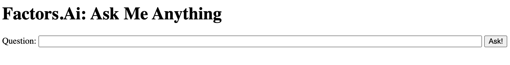

# ChatGPT PoC

## Setup
> Note: Use `python` or `python3` (correspondingly `pip` or `pip3`) based on whichever points to Python 3.
- Step 1: Move into this directory
  - `cd factors/misc/chatgpt_poc`
- Step 2: Check if you have Python 3
  - `python --version`
  should return `Python 3.\*.\*`
  - If the above command gives an error or returns `Python 2.\*.\*`, try `python3 --version`.
  - If you still get a not-found error, you might have to install Python. Check [here](https://realpython.com/installing-python/).
- Step 3: Install requirements
  - `pip install -r requirements.txt`
  - If `pip` doesn't work or points to Python 2, use `pip3`
  - Ignore the `pip` upgrade warning, if any.

## Usage
### Step 1: Set up OpenAI API Key
Create a new file (or edit if exists), `factors/misc/chatgpt_poc/key.json` with the following content:
  ```
  {"key": "OPENAI_API_KEY"}
  ```
  and replace `OPENAI_API_KEY` with your actual API key that can be downloaded from [here](https://platform.openai.com/account/api-keys).
### Step 2: Run main.py
- `python main.py -h` or `python main.py --help` for more help:
  ```
  python main.py [-h] [--model MODEL] [--scratch] [-s] prompt

  positional arguments:
    prompt         The question you want to ask about your data (E.g., "How many users visited our website last month?")

  optional arguments:
    -h, --help     show this help message and exit
    --model MODEL  The model to use -- fine-tuned ("ft") or information-retrieval ("ir").
    --scratch      If "ft", fine-tune model again, and if "ir", generate embeddings from scratch.
    -s, --silent   Silent
  ```

   (Use `python3 main.py` if it doesn't work)

## Standard examples
### Example 1: Using fine-tuned model
```python main.py --model ft "How many users visited our website last month?"```

Prints to `stdout`:

```{qt:kpi,time:lastmonth,qe:unique_users,qf:-,qb:-}```

Under the hood:
- `chat.py: chat_once_mode()`
  - First fetches the name of the fine-tuned model from the `"latest"` key in `ft_model.json`:
    - ```
      {
      "latest": "davinci:ft-personal-2023-05-05-04-02-17",
      "historical": ["davinci:ft-personal-2023-05-05-04-02-17"]
      }
      ```
  - Then it runs `chat.py: ask_fine_tuned_model()` that fetches an answer from OpenAI using `openai.Completion.create` and the fine-tuned model

### Example 2: Using information-retrieval based model
```python main.py --model ir "How many users visited our website last month?"```

Prints to `stdout`:

```{qt:kpi,time:last_month,qe:unique_users,qf:-,qb:-}```

Under the hood:
- Given a question at hand, `q`.
- `chat.py: chat_once_mode()`
  - First fetches the prepared data from `data_cached.csv` or prepares data from scratch using `data_preparer.py: prepare_data()` and `data.json`
  - Then it finds top 10 matching query-response examples based on BERT embeddings based 10-nearest-neighbours `q1, q2, ..., q10`, using `chat.py: get_matching_examples()`, giving us `q1->r1`, `q2->r2`, ..., `q10->r10` from pre-indexed data.
    - Embeddings for all queries in `data.json` are cached at `prompt_emb_cache.pkl`.
  - Now, it forms a prompt for one-shot learning as follows:
  ```
  q1 -> r1
  q2 -> r2
     ...
  q10 -> r10
  q ->
  ```
  - This prompt is directly queried on OpenAI using `openai.Completion.create` and the `text-davinci-003` model.

## Fine-tuning model from scratch
To fine-tune a model from scratch, run the following:

```python main.py --model ft --scratch "How many users visited our website last month?"```

This trains a new fine-tuned model using data from `data_cached.csv` (falls back to `data.json` if cache not found). It uses a function `chat.py: retrain_fine_tuned_model()`, that after retraining, modifies `ft_model.json` with the latest model's name.

- TODO: A previously fine-tuned model should ideally be **retrained** and fine-tuned models should not be produced from scratch.

## Learning embeddings in IR based model from scratch
- METHOD 1:
  
  ```python main.py --model ir --scratch "How many users visited our website last month?"```
- METHOD 2:
  Simply delete `data.json`, `data_cached.csv`, and `prompt_emb_cache.pkl` and put a new `data.json` to pick data from here instead.

## Hosting a chatbot (using `flask` and `ngrok`)
A very basic implementation of hosting a chatbot based on the "fine-tuned" model.
- Step 1: Start a Flask server:
  ```
  python ama.py
  ```
  This starts a Flask server on `http://127.0.0.1:5000` by default. If this is different, note it and let it be `http://xyz:abc`. For example, you see:
  ```
   * Serving Flask app 'ama'
   * Debug mode: off
  WARNING: This is a development server. Do not use it in a production deployment. Use a production WSGI server instead.
   * Running on http://127.0.0.1:5000
  Press CTRL+C to quit
  ```

- Step 2: Create an ngrok endpoint:
  
  (Assumption: you have `ngrok` installed and set up. If not, check it out [here](https://ngrok.com/docs/getting-started/).)

  On a terminal, run the following:
  ```
  ngrok http://127.0.0.1:5000
  ```
  (or `ngrok http://xyz:abc` based on what `python ama.py` returns)

  This might give, for example,
  ```
  ngrok               (Ctrl+C to quit)
  
  Take our ngrok in production survey! https://forms.gle/aXiBFWzEA36DudFn6
  
  Session Status: online                                 
  Account: govind@factors.ai (Plan: Free)
  Update: update available (version 3.3.4, Ctrl-U to update)
  Version: 3.2.1
  Region: Europe (eu)
  Latency: 40ms
  Web Interface: http://127.0.0.1:4040
  Forwarding: https://edf3-81-109-135-85.ngrok-free.app -> http://127.0.0.1:5000
  
  Connections: ttl opn rt1  rt5  p50  p90
               0   0   0.00 0.00 0.00 0.00
  ```
  Just note the "Forwarding" address (here, `https://edf3-81-109-135-85.ngrok-free.app`)
- Step 3: Open a browser anywhere
  
  Now, navigate to the "Forwarding" address from above: e.g., `https://edf3-81-109-135-85.ngrok-free.app`

  All it asks you is to click on a button saying "Visit Site". Do that and you have your website open in front of you.
  

- Step 4: Keep asking questions via the chat-box. Please refresh when you ask a new question.

Finally, to cancel `ngrok` or `flask` serving, simply press `Ctrl+C` on the corresponding Terminal.
